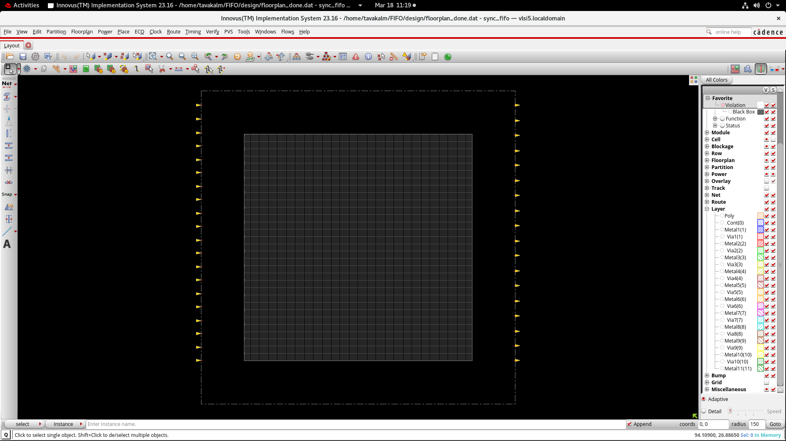
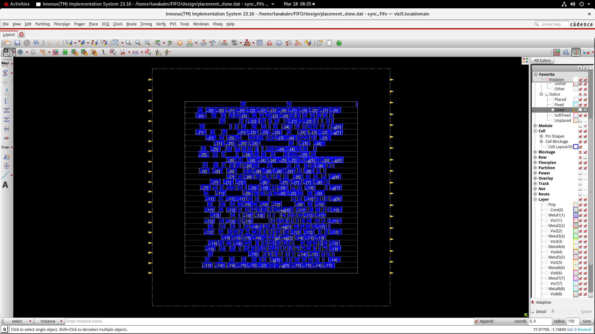
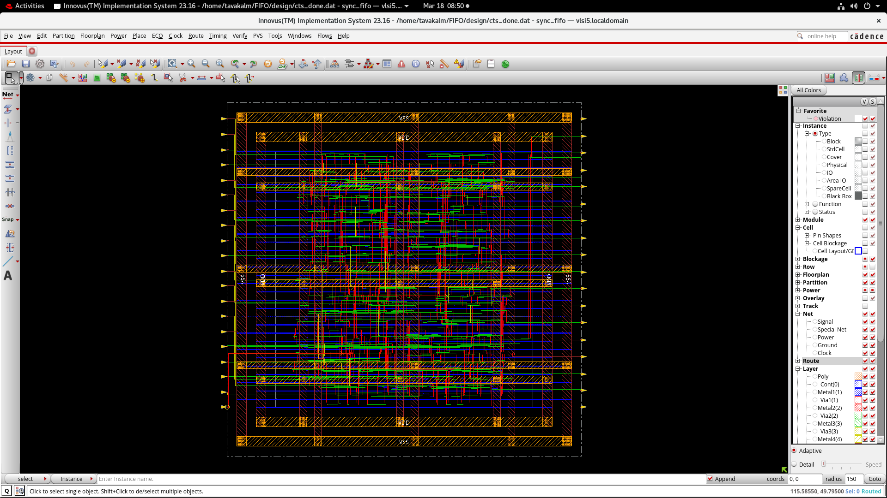
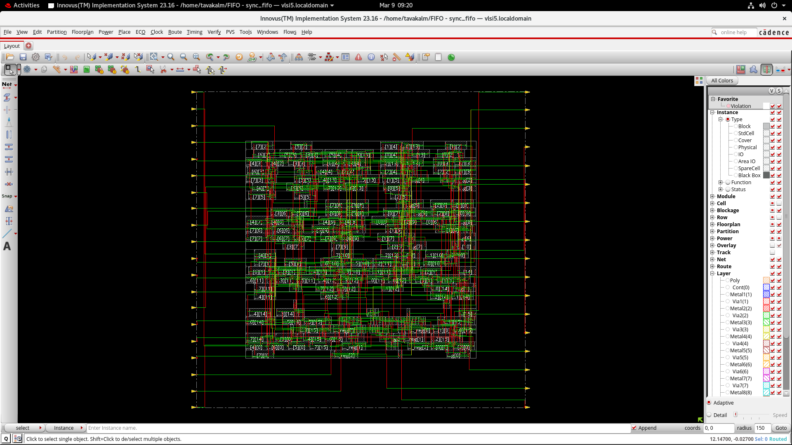
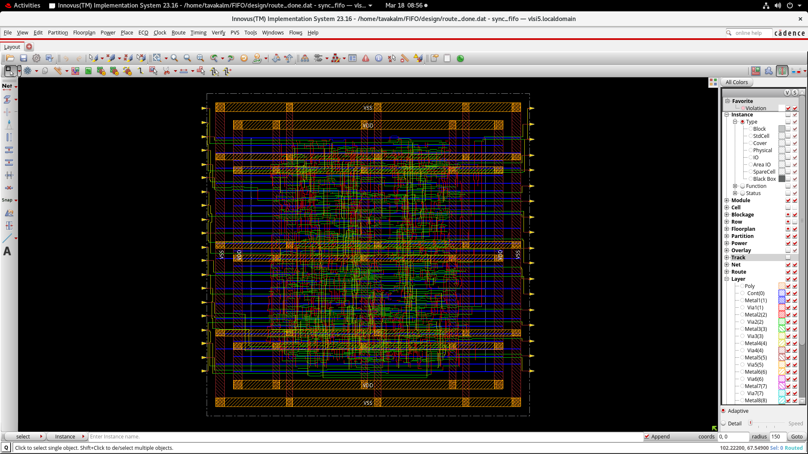

# FIFO ASIC Physical Design using Cadence Innovus

## 📌 Overview

This project demonstrates the complete Physical Design (PD) flow of a FIFO (First-In First-Out) design using Cadence Innovus.

---

## 🔧 Tools Used

* Cadence Innovus
* Verilog HDL
* TCL scripting

---

## 🚀 Physical Design Flow

1. Floorplanning
2. Power Planning
3. Placement
4. Clock Tree Synthesis (CTS)
5. Routing
6. Timing Analysis

---

## 📸 Design Snapshots

### Floorplan

### Placement

### CTS

### Routing

### Final Layout

---

## 📊 Final Results & Analysis

### ⏱ Timing Summary

* **Post-CTS Setup Slack:** +0.069 ns ✅ (Met)
* **Post-CTS Hold Slack:** -0.046 ns ❌ (Expected violation due to fast paths)
* **Post-Route Setup Slack:** -0.032 ns ⚠️ (Minor violation ~32 ps)

> Note: The small setup violation after routing can be fixed using post-route optimization (`optDesign -postRoute -setup`).

---

### ⚡ Power Analysis

* **Total Power:** 0.3496 mW

  * **Internal Power:** 0.2618 mW (74.8%)
  * **Switching Power:** 0.0877 mW (25.0%)
  * **Leakage Power:** 0.00013 mW (~0%)

* **Clock Power Contribution:** ~38.95% of total power

> Note: Power estimation used default switching activity (0.2), hence values are approximate.

---

### 📐 Area Summary

* **Total Standard Cells:** 634
* **Total Area:** 1852.27 µm²

---

### 🔍 Key Observations

* Hold violations observed after CTS are expected due to fast data paths and are resolved in later stages.
* Minor setup violation after routing indicates near timing closure.
* Clock network contributes significantly to total power, which is typical in synchronous designs.
* Design demonstrates realistic ASIC physical design challenges including timing closure and power distribution.

---

### 🏁 Conclusion

The FIFO design successfully completes the full physical design flow with near timing closure, optimized power consumption, and compact area, reflecting industry-relevant design trade-offs and optimization strategies.

## 👨‍💻 Author

Tavakalmastan
